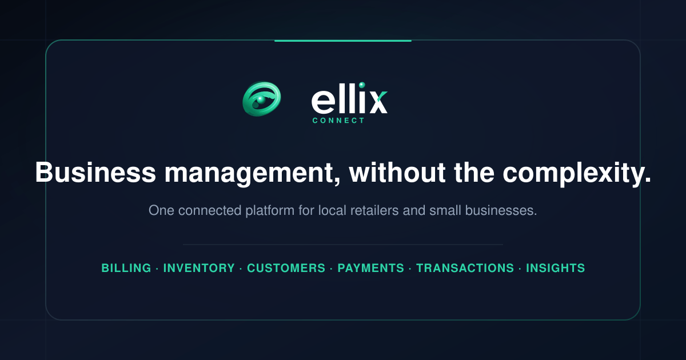
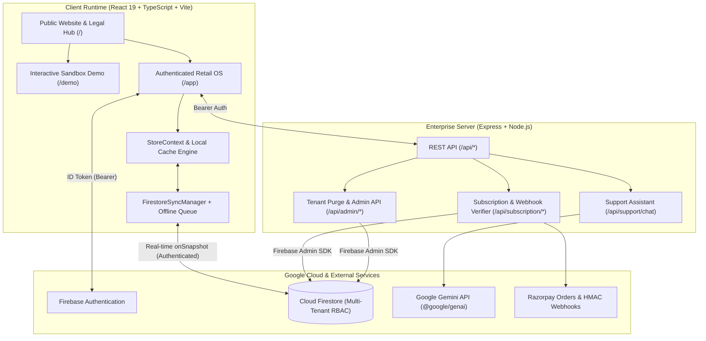

<div align="center">



<br />

# Ellix Connect

**Business management, without the complexity.**

Ellix Connect brings **billing**, **inventory**, **customers**, **payments**, **transactions**, and **business insights** into one connected platform for local retailers, supermarkets, and small businesses.

[](https://ellix-connect.ai.studio/)
[](https://www.typescriptlang.org/)
[](https://react.dev/)
[](https://vite.dev/)
[](https://tailwindcss.com/)
[](https://firebase.google.com/)

[Live Demo](https://ellix-connect.ai.studio/) · [Architecture](#-system-architecture) · [Core Modules](#-core-modules) · [Getting Started](#-getting-started) · [Security Policy](./SECURITY.md) · [Contributing](./CONTRIBUTING.md)

</div>

---

## Overview

Local retail stores and small businesses often juggle disconnected tools—paper registers for customer credit (*Khata*), spreadsheets for stock counts, standalone calculators for counter billing, and separate apps for payment tracking.

**Ellix Connect** unifies daily retail operations into a single, offline-resilient web workspace designed specifically for Indian retail stores, supermarkets, and wholesale distributors:

- **Counter Billing & GST Invoicing** with barcode scanning, thermal receipt formatting (58mm / 80mm), and itemized CGST/SGST/IGST breakdowns.
- **Real-Time Inventory & Stock Control** with SKU/barcode catalogs, automatic stock deduction on sale, low-stock threshold alerts, and supplier restock workflows.
- **Digital Customer Khata (Ledger) & CRM** with customer purchase histories, credit balance tracking, and instant WhatsApp payment reminder links.
- **Multi-Tender Payment Recording** supporting Cash, Card, Credit (*Khata*), and dynamic UPI QR codes generated directly from the merchant's configured UPI VPA.
- **Offline-First Continuity** powered by local browser storage queues that automatically synchronize with Google Cloud Firestore when connectivity returns.

---

## Core Modules

| Module | Key Capabilities |
| :--- | :--- |
| **1. Billing POS** | Barcode scan & search checkout, split/multi-tender payments, configurable GST slabs (0%, 5%, 12%, 18%, 28%), printable thermal (58mm/80mm) & A4 GST invoice templates, WhatsApp invoice sharing. |
| **2. Inventory & Stock** | SKU & barcode catalog, batch & stock quantity tracking, low-stock threshold alerts, barcode label generator, CSV import/export, and supplier restock logs. |
| **3. Customer Khata & CRM** | Customer profiles, credit ledger (*Khata*) balances, partial/full payment settlements, loyalty segments, and one-click WhatsApp balance reminders with UPI links. |
| **4. Wholesale & B2B Network** | Retailer–wholesaler connections, digital purchase order (PO) requests, quotation review, and restock order tracking. |
| **5. Reports & Business Insights** | Day-end sales summaries, itemized tax summary schedules (GSTR-1 / GSTR-3B / HSN reference sheets), inventory valuation, and PDF/CSV data exports. |
| **6. Staff Roles & Multi-Store** | Role-based access control (`Client`, `Crew`, `Wholesaler`, `Ellix Admin`, `Super Admin`), store-scoped data isolation, and activity audit logs. |

---

## System Architecture



### Key Architectural Highlights

1. **Zero-Overhead Public Landing Load**: Unauthenticated visitors on `/` receive pre-minified, immutable hashed bundles without triggering background Firestore listeners or loading heavy dashboard-only chunks (`jspdf`, `recharts`).
2. **Offline-Resilient Store Synchronization**: `FirestoreSyncManager` queues mutations in `localStorage` (`ellix_offline_sync_queue`) when offline and flushes changes automatically to Cloud Firestore upon reconnection.
3. **Strict Multi-Tenant Isolation**: Every store's operational collections (`/stores/{storeId}/products`, `invoices`, `customers`, `employees`, `suppliers`, `restockOrders`, `auditLogs`) are isolated by `storeId` and protected by `firestore.rules`.
4. **Authoritative Server-Side Verification**: Subscription checkouts, HMAC-SHA256 webhook verification (`crypto.timingSafeEqual`), and full tenant data purges run strictly on the Express backend using the Firebase Admin SDK.

---

## Role-Based Access Control (RBAC)

| Role | Identifier | Access Scope |
| :--- | :--- | :--- |
| **Super Admin** | `super_admin` | Platform-wide administration, Ellix Admin team provisioning/revocation, tenant management, and business application approvals. |
| **Ellix Admin** | `ellix_admin` | Platform operations, merchant onboarding review, and tenant support operations. |
| **Merchant / Client** | `client` | Full store management across assigned stores: Billing POS, Inventory, Customer Khata, Staff Roles, Reports, and Subscription settings. |
| **Store Crew / Cashier** | `crew` | Counter POS billing and inventory restock logging within assigned stores; restricted from destructive tenant or subscription actions. |
| **Wholesaler Admin** | `wholesaler_admin` | B2B catalog management, incoming retailer restock order quotations, and dispatch status updates. |

---

## Project Structure

```text
├── public/                        # Static public assets & SEO/discovery files
│   ├── assets/logo/               # Official brand SVG/PNG logos
│   ├── favicon.svg                # Vector browser favicon
│   ├── llms.txt                   # Concise AI/LLM platform summary
│   ├── llms-full.txt              # Extended technical reference for crawlers
│   ├── manifest.json              # Web App Manifest (PWA metadata)
│   ├── og-image.png               # 1200×630 Open Graph / social preview image
│   ├── robots.txt                 # Search crawler directives
│   └── sitemap.xml                # Canonical public URL sitemap
├── scripts/
│   └── generate-og-png.mjs        # Utility script to render og-image.svg -> og-image.png
├── src/
│   ├── components/
│   │   ├── admin/                 # Super Admin & Ellix Admin management panels
│   │   ├── auth/                  # Firebase Auth modals & Account Sync Hub
│   │   ├── common/                # Navbar, Sidebar, BottomNavigation, SupportChatbot
│   │   ├── landing/               # Public marketing landing page & interactive preview
│   │   ├── legal/                 # Legal Compliance Hub & Security disclosure views
│   │   ├── research/              # Customer Journey Map visualization
│   │   ├── retailer/              # Core POS, Inventory, Khata CRM, Reports, Staff, Suppliers
│   │   ├── subscription/          # Subscription paywall & billing management
│   │   └── wholesaler/            # B2B Wholesaler portal
│   ├── config/                    # Legal & route configuration
│   ├── context/                   # AuthContext, StoreContext, ThemeContext
│   ├── data/                      # Sandbox demo & fallback seed datasets
│   ├── lib/                       # Firebase client initialization & FirestoreSyncManager
│   ├── utils/                     # GST invoice PDF/print & CSV export utilities
│   ├── App.tsx                    # Root route protection, lazy view loader, & layout shell
│   ├── main.tsx                   # React 19 DOM entry point
│   └── types.ts                   # Shared TypeScript interfaces & domain models
├── .env.example                   # Template for required environment variables
├── firebase-blueprint.json        # Firestore data model blueprint
├── firestore.rules                # Production Firestore security & tenant isolation rules
├── index.html                     # Canonical HTML entry point with JSON-LD & Open Graph tags
├── server.ts                      # Express full-stack server, API routes & static asset server
├── tsconfig.json                  # TypeScript compiler configuration
└── vite.config.ts                 # Vite 6 + Terser + Tailwind CSS 4 build configuration
```

---

## Getting Started

### Prerequisites

- **Node.js** `>= 22.0.0`
- **npm** `>= 10.0.0`
- A **Google Firebase** project with **Authentication** and **Cloud Firestore** enabled

### 1. Clone the Repository

```bash
git clone https://github.com/your-username/ellix-connect.git
cd ellix-connect
```

### 2. Install Dependencies

```bash
npm install
```

### 3. Configure Environment Variables

Copy `.env.example` to `.env` and supply your environment credentials:

```bash
cp .env.example .env
```

| Variable | Required | Description |
| :--- | :---: | :--- |
| `GEMINI_API_KEY` | Optional | Google Gemini API key used by the server-side `/api/support/chat` endpoint (falls back to built-in knowledge base if omitted). |
| `APP_URL` | Optional | Public canonical URL of the deployment (e.g., `https://ellix-connect.ai.studio/`). |
| `FIREBASE_PROJECT_ID` | Optional | Overrides the Firebase project ID from `firebase-applet-config.json`. |
| `FIRESTORE_DATABASE_ID` | Optional | Overrides the Firestore database ID from `firebase-applet-config.json`. |
| `RAZORPAY_KEY_ID` | Optional | Razorpay API Key ID for live subscription order creation. |
| `RAZORPAY_KEY_SECRET` | Optional | Razorpay API Key Secret for order creation & payment verification. |
| `RAZORPAY_WEBHOOK_SECRET` | Optional | Secret for verifying `x-razorpay-signature` via HMAC-SHA256. |

### 4. Start the Development Server

```bash
npm run dev
```

The full-stack Express + Vite development server starts on `http://localhost:3000`.

---

## Available Scripts

| Command | Description |
| :--- | :--- |
| `npm run dev` | Starts the full-stack Express server with Vite middleware in development mode (`tsx server.ts`). |
| `npm run build` | Compiles and minifies the production frontend bundle into `dist/` using Vite and Terser. |
| `npm start` | Starts the production Express server (`node server.ts`), serving immutable assets from `dist/` and `/api/*` routes. |
| `npm run lint` | Runs TypeScript type-checking across the codebase (`tsc --noEmit`). |
| `npm run clean` | Removes compiled build artifacts (`dist/`). |

---

## Backend API Endpoints

| Method | Endpoint | Auth | Description |
| :--- | :--- | :--- | :--- |
| `GET` | `/api/health`, `/healthz` | Public | Liveness and readiness health check for Cloud Run / load balancers. |
| `GET` | `/api/about`, `/api/metadata` | Public | Machine-readable platform capabilities and metadata JSON. |
| `POST` | `/api/support/chat` | Public | 24/7 customer support assistant powered by Gemini with local fallback. |
| `POST` | `/api/subscription/create-checkout` | Bearer Token | Initiates a tenant-scoped Razorpay subscription checkout order. |
| `POST` | `/api/subscription/verify-payment` | Bearer Token | Cryptographically verifies Razorpay checkout signatures (`HMAC-SHA256`). |
| `POST` | `/api/subscription/webhook` | Webhook HMAC | Verifies raw-body `x-razorpay-signature` and updates tenant subscription state. |
| `POST` | `/api/admin/tenant/purge` | Bearer Token | Permanently deletes all stores and subcollections for an authorized tenant. |
| `GET` | `/api/admin/team` | Super Admin | Lists provisioned `ellix_admin` and `super_admin` accounts. |
| `POST` | `/api/admin/team/create` | Super Admin | Invites or provisions an `ellix_admin` team member. |
| `POST` | `/api/admin/team/revoke` | Super Admin | Revokes admin privileges and reverts the user role to `client`. |

---

## Security, Privacy & Compliance Scope

- **Authentication & Access Control**: Managed via Google Firebase Authentication with server-side ID token verification (`adminAuth.verifyIdToken`) on protected API endpoints.
- **Database Isolation**: Enforced via `firestore.rules` so authenticated users can only access stores and records belonging to their authorized tenant/role.
- **Tax & GST Scope**: Ellix Connect calculates itemized CGST, SGST, and IGST breakdowns based on merchant-configured product tax rates and exports reference schedules. Merchants remain responsible for verifying tax rates and completing statutory filings on official government portals.
- **Vulnerability Reporting**: Please review [SECURITY.md](./SECURITY.md) for responsible disclosure instructions.

---

## Contributing

Contributions, bug reports, and feature enhancements are welcome! Please read our [Contributing Guide](./CONTRIBUTING.md) and [Code of Conduct](./CODE_OF_CONDUCT.md) before submitting a pull request.

---

## License

Distributed under the **MIT License**. See [LICENSE](./LICENSE) for full license text.
